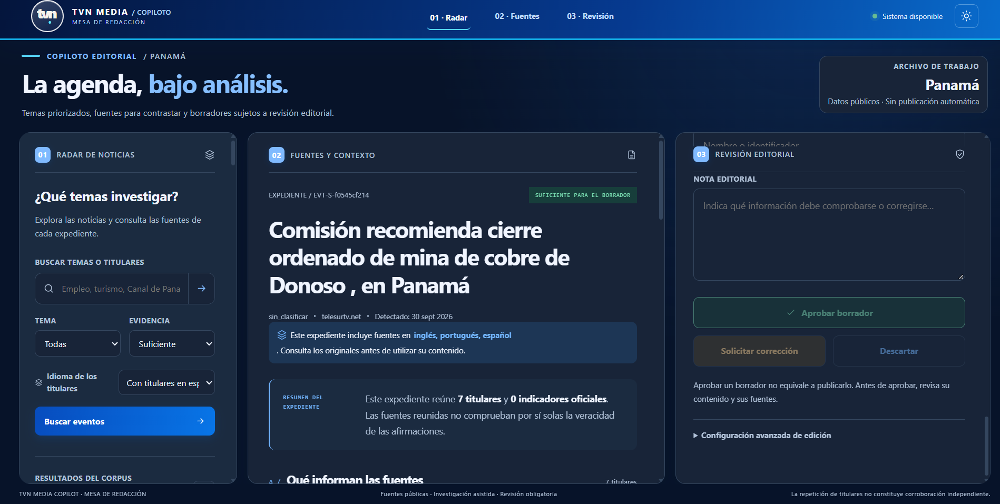
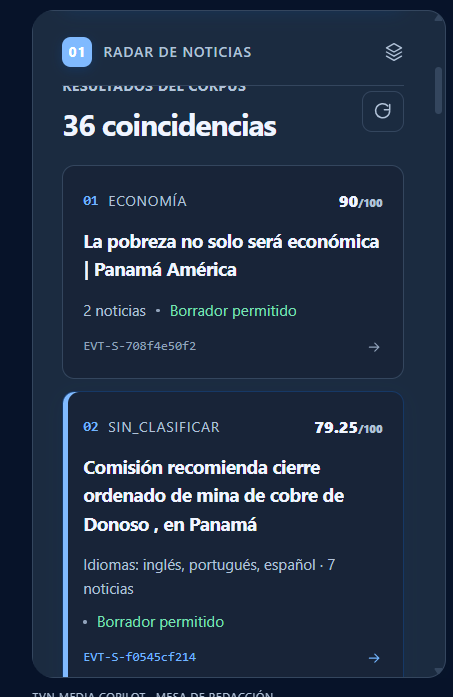
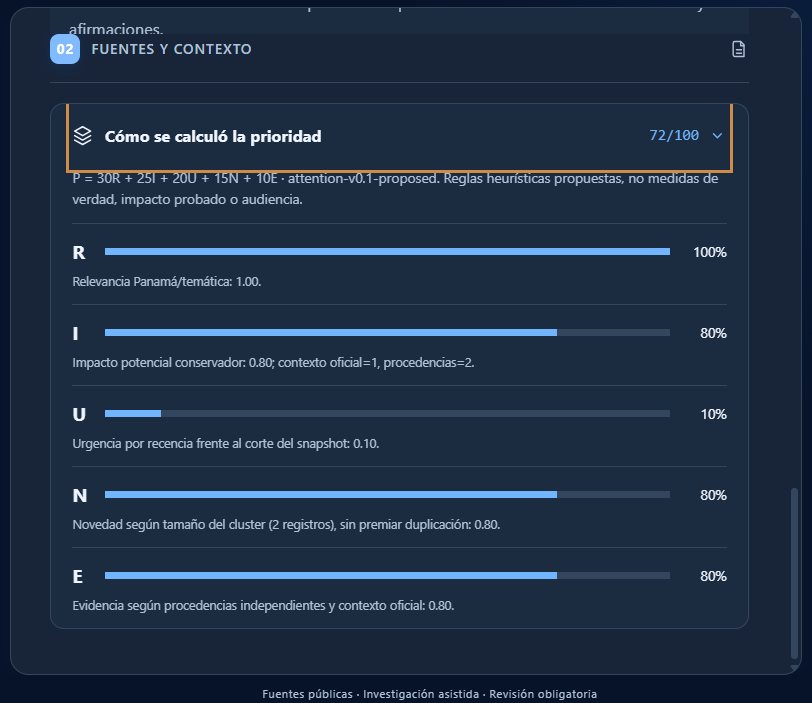
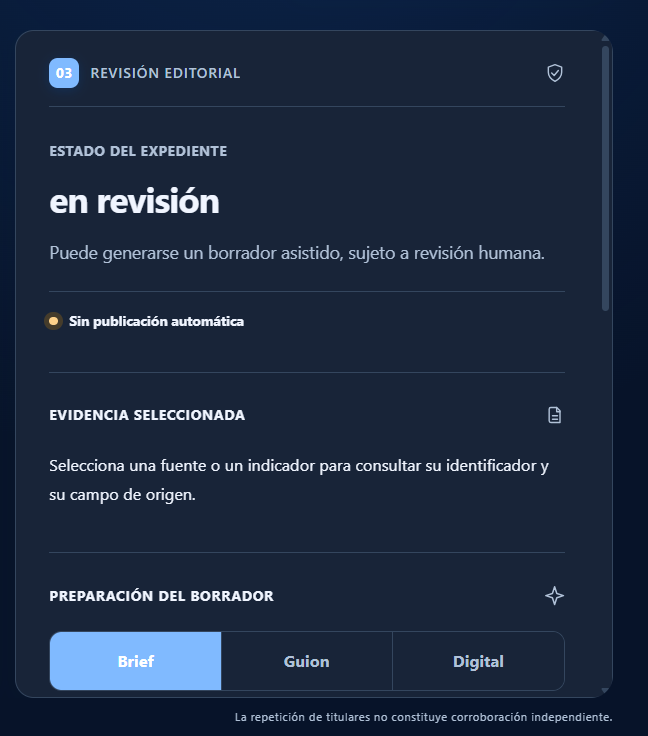
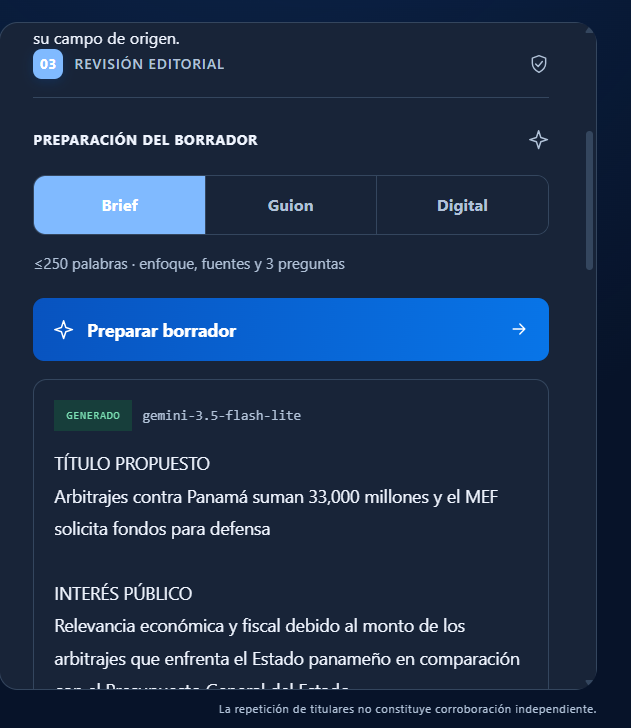

# TVN Media Copilot

Prototipo editorial para el reto **“De la señal a la decisión”**. Convierte noticias públicas e indicadores oficiales en una agenda priorizada, fichas de evidencia y borradores editoriales sujetos a revisión humana.

> **Modalidad:** TVN Media  
> **Estado:** MVP funcional · v0.9.1  
> **Principio:** prioridad ≠ verdad ≠ publicación.

<!-- TVN_DEMO_VISUAL_INICIO -->

## 🖥️ Demostración visual del prototipo

**[▶ Abrir TVN Media Copilot](https://tvn-media-copilot.vercel.app/)** · **[Documentación técnica](https://app.notion.com/p/3f422cd4c39a81d38d9bc285745608c4)** · **[Documentación funcional](https://app.notion.com/p/3f422cd4c39a81c2b622eb63b9b8a1df)** · **[Pitch Day en Notion](https://app.notion.com/p/3f422cd4c39a818e9bc4d0e46d2bcdf7)**

El copiloto integra **Radar de noticias → Fuentes y contexto → Revisión editorial**. Estas imágenes corresponden a capturas reales de la interfaz del 8 de octubre de 2026; muestran funciones visibles, **no** certifican la veracidad de los titulares ni la persistencia del sistema tras un reinicio.

### Mesa de Redacción

<p align="center"></p>

### 01 · Radar y ranking explicable

| Exploración de noticias | Desglose de prioridad |
|:---:|:---:|
|  |  |

El ranking utiliza **P = 30R + 25I + 20U + 15N + 10E**. En el ejemplo visible: R=1.00, I=0.80, U=0.10, N=0.80 y E=0.80, de modo que **P=72/100**. Esta puntuación orienta la atención editorial; **no representa la probabilidad de que una noticia sea verdadera**.

### 02 · Fuentes y contexto

<p align="center"></p>

Se muestran fuentes como prensa.com y panamaamerica.com.pa con identificadores `NEWS-...`. **Dos procedencias no garantizan corroboración independiente**; los datos proceden de titulares/metadatos y deben verificarse contra fuentes originales.

### 03 · Revisión y generación asistida

| Estado del expediente | Brief generado con Gemini |
|:---:|:---:|
|  |  |

El sistema ofrece **brief**, **guion** y **copy digital**, con revisión humana obligatoria y **sin publicación automática**. La captura del brief muestra el uso de `gemini-3.5-flash-lite`. No acredita por sí sola la validez factual de cada afirmación ni la conservación de una aprobación tras reiniciar el servicio.

### Evidencia y evaluación

- **Suite en Windows, commit `11fffe0`: 67 pruebas aprobadas, 2 advertencias, 32.36 segundos.** Los diez escenarios T01–T10 están incluidos como pruebas automatizadas controladas; esto no implica aceptación integral en producción.
- **Datos del snapshot:** 1,728 noticias (50 TVN RSS + 1,678 GDELT); cuadrícula de 540 combinaciones de indicadores del Banco Mundial (6 países × 6 indicadores × 15 años).
- **Clustering en muestra de desarrollo:** F1 baseline 0.9189; F1 semántico 0.9444 (120 etiquetas). No constituye evaluación editorial independiente de todas las noticias.
- **Límites explícitos:** la prueba offline completa (frontend + backend + snapshot), persistencia de revisiones tras reiniciar Render y soporte semántico de las citas necesitan validaciones adicionales. En una auditoría remota de 16 solicitudes hubo 9 respuestas HTTP 200 y 7 errores; un `/health` manual posterior respondió 200. No se considera una medición de disponibilidad concluyente.

**[Expediente de evaluación: siete secciones](https://app.notion.com/p/3f422cd4c39a8142beb8d75cde2e9d90)** · **[Matriz T01–T10](https://app.notion.com/p/3f422cd4c39a810ca58de264ca2aac11)** · **[Anexo de capturas](https://app.notion.com/p/3f422cd4c39a8111b800e9b38cd1a72b)**

<!-- TVN_DEMO_VISUAL_FIN -->

## Qué demuestra

El MVP recorre el flujo principal del reto:

```text
Fuentes públicas
→ validación y normalización
→ clasificación y agrupación
→ contextualización
→ ranking R/I/U/N/E
→ ficha de evidencia
→ borrador editorial
→ revisión humana
```

Incluye:

- TVN RSS + GDELT como fuentes de noticias.
- Banco Mundial como contexto estructurado.
- clasificación temática y agrupación de noticias del mismo evento;
- baseline simple y clustering semántico para comparación;
- ranking explicable con `P = 30R + 25I + 20U + 15N + 10E`;
- estados de evidencia independientes del puntaje;
- generación con Gemini únicamente cuando la evidencia lo permite;
- brief, guion de 45–60 s y copy digital;
- abstención ante evidencia insuficiente;
- revisión humana y sin publicación automática;
- snapshot y fallback/cache para la demo offline.

## Stack

- **Backend:** FastAPI
- **Frontend:** Next.js / React
- **Persistencia:** DuckDB
- **NLP/ML:** scikit-learn + Sentence Transformers
- **LLM:** Gemini
- **Python:** 3.12
- **Contenedores:** Docker Compose

## Instalación

### 1. Python

En PowerShell, desde la raíz del repositorio:

```powershell
py -3.12 -m venv .venv
.\.venv\Scripts\Activate.ps1
python -m pip install --upgrade pip
pip install -r requirements.txt
```

Para regenerar embeddings semánticos:

```powershell
pip install -r requirements-semantic.txt
```

### 2. Variables de entorno

```powershell
Copy-Item .env.example .env
```

Completa en `.env` únicamente tus valores privados, por ejemplo:

```env
GEMINI_API_KEY=TU_CLAVE
GEMINI_MODEL=gemini-3.5-flash-lite
```

`.env` no debe subirse al repositorio.

### 3. Preparar la base local

```powershell
.\bootstrap_backend.bat
```

## Ejecutar

### Backend

```powershell
.\run_backend.bat
```

API:

```text
http://localhost:8000
http://localhost:8000/docs
```

### Frontend

Primera ejecución:

```powershell
cd frontend
Copy-Item .env.local.example .env.local
npm install
npm run dev
```

Después puede iniciarse desde la raíz con:

```powershell
.\run_frontend.bat
```

Aplicación:

```text
http://localhost:3000
```

## Pruebas

```powershell
pytest -q
```

Ejecución final comunicada en Windows sobre el commit `11fffe0`:

```text
67 passed, 2 warnings in 32.36s
```

Los reportes de evaluación se conservan en `reports/`.

## Datos y reproducibilidad

El proyecto mantiene separados:

```text
data/snapshot/      snapshot público congelado
data/processed/     datos normalizados y resultados reproducibles
reports/            calidad, baseline y evaluación
data/raw/            descargas regenerables; no necesarias para la demo
```

El pipeline de datos conserva fechas, nulos, unidades y procedencia. Una afirmación factual generada debe estar vinculada a evidencia identificable.

Para reconstruir el pipeline sobre el snapshot existente:

```powershell
.\run_real_pipeline.bat
```

La ingesta desde fuentes públicas puede ejecutarse por separado cuando sea necesario:

```powershell
.\run_ingestion.bat
```

La demo principal debe utilizar el snapshot congelado y no depender de una fuente de noticias en vivo.

## Demo offline

Las generaciones validadas pueden precargarse:

```powershell
python scripts\prewarm_generation_cache.py
```

Con:

```env
ALLOW_CACHED_GENERATION=true
```

el backend puede reutilizar una salida previamente validada cuando corresponde exactamente al mismo paquete de evidencia.

> Para la entrega final, el artefacto/cache necesario para T10 debe acompañar la demo si no se versiona directamente en Git.

## Salidas editoriales

El sistema produce:

- **Brief:** máximo 250 palabras, título, interés público, 3 preguntas, fuentes y pendientes.
- **Guion:** objetivo de 45–60 segundos.
- **Copy digital:** máximo 80 palabras.

Si el sistema solo dispone de titular/metadatos, la salida debe indicarlo. No se inventan entrevistas, citas, causalidades ni información ausente.

## IA y evaluación

El componente semántico usa:

```text
sentence-transformers/paraphrase-multilingual-MiniLM-L12-v2
```

Evaluación humana registrada sobre 120 etiquetas:

| Método | Precision | Recall | F1 |
|---|---:|---:|---:|
| Baseline | 0.9444 | 0.8947 | 0.9189 |
| Semántico | 1.0000 | 0.8947 | 0.9444 |

El clustering semántico fue seleccionado para el MVP sobre esa muestra.

## Estructura principal

```text
backend/        API, ranking, evidencia, generación y revisión
frontend/       interfaz editorial
src/            lógica NLP/ML y contratos
scripts/        ingesta, evaluación y utilidades
tests/          pruebas automatizadas
data/           snapshot y datos procesados
reports/        resultados verificables
docs/           arquitectura, decisiones e historial
```

## Documentación

La información extensa se mantiene fuera del README:

- [`CHANGELOG.md`](CHANGELOG.md)
- [`docs/DEVELOPMENT_HISTORY.md`](docs/DEVELOPMENT_HISTORY.md)
- [`docs/ARCHITECTURE.md`](docs/ARCHITECTURE.md)
- [`docs/DECISIONS.md`](docs/DECISIONS.md)
- [`docs/TESTING_AND_METRICS.md`](docs/TESTING_AND_METRICS.md)
- [`docs/notion_temp/`](docs/notion_temp/) — copia histórica de trabajo (no sustituye las páginas de Notion).

## Notion y entrega

La entrega del hackIAthon ya cuenta con documentación organizada en Notion: [página de entrega](https://app.notion.com/p/3f422cd4c39a81f39809cefaba235252), [documentación técnica](https://app.notion.com/p/3f422cd4c39a81d38d9bc285745608c4), [documentación funcional](https://app.notion.com/p/3f422cd4c39a81c2b622eb63b9b8a1df) y [pitch visual de 10 minutos](https://app.notion.com/p/3f422cd4c39a818e9bc4d0e46d2bcdf7). Las URL deben verificarse en una sesión privada y publicarse según los permisos que establezca el equipo; un enlace de edición/copiar no garantiza acceso público.

Antes del cierre deben verificarse:

- acceso del jurado al repositorio y a Notion;
- catálogo de fuentes y snapshot/manifest;
- al menos 5 casos trazables, incluido uno con evidencia insuficiente;
- matriz T01–T10 y métricas finales;
- demo offline;
- pitch de 10 minutos desde Notion.

## Seguridad y límites

- No guardar secretos en Git, logs o Notion público.
- El contenido recuperado se trata como datos, no como instrucciones.
- Si falta evidencia, el sistema debe abstenerse.
- Una prioridad alta no autoriza publicación.
- Toda salida es un borrador sujeto a revisión humana.
